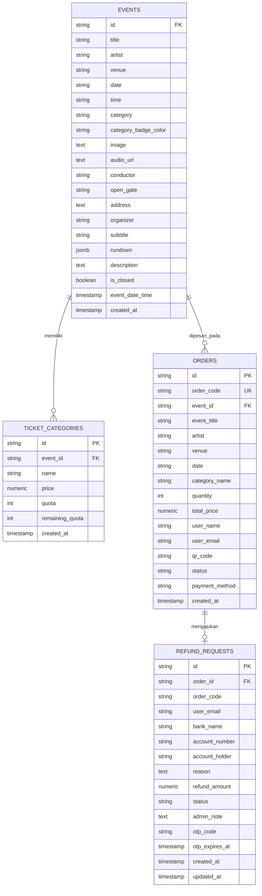

# 🎼 SymphoniaTic Backend API

High-Performance Native REST API Server untuk Platform Pemesanan Tiket Konser Mahakarya & Orkes Simfoni **SymphoniaTic**, dibangun menggunakan **Go (Golang)**, **Go Fiber v2**, **PostgreSQL 16**, **Docker**, dan **SMTP Mailpit Integration**.

---

## 📋 Daftar Isi
- [🚀 Fitur Utama](#-fitur-utama)
- [🛠️ Teknologi & Stack](#️-teknologi--stack)
- [📐 Arsitektur & Skema Basis Data (ERD)](#-arsitektur--skema-basis-data-erd)
- [⚙️ Konfigurasi Environment (`.env`)](#️-konfigurasi-environment-env)
- [🚀 Panduan Instalasi & Cara Menjalankan](#-panduan-instalasi--cara-menjalankan)
- [📚 Dokumentasi Lengkap Endpoint API (`/api/v1`)](#-dokumentasi-lengkap-endpoint-api-apiv1)
  - [🌐 Endpoint Publik (Guest & User)](#-endpoint-publik-guest--user)
  - [🔐 Endpoint Refund Tiket (Verifikasi OTP)](#-endpoint-refund-tiket-verifikasi-otp)
  - [👑 Endpoint Admin & Manajemen](#-endpoint-admin--manajemen)
- [📊 Standar Respons API](#-standar-respons-api)
- [🧪 Pengujian & Testing](#-pengujian--testing)

---

## 🚀 Fitur Utama

1. **Guest Checkout (Tanpa Login)**
   - Pembelian tiket instan secara cepat tanpa hambatan pendaftaran akun.
   - Penjumlahan harga otomatis dan penerbitan kode tiket unik (`SYM-XXXXXX`).

2. **Performa Tinggi & Keamanan High Concurrency (*Ticket War*)**
   - Menggunakan **Row-Level Locking (`FOR UPDATE`)** pada PostgreSQL untuk alokasi kuota tiket secara atomic.
   - Mencegah *race condition* dan *overbooking* saat ribuan pembeli mengakses tiket konser populer secara bersamaan.

3. **Infrastruktur Database PostgreSQL & Auto Migration**
   - Skema database relasional otomatis terinisialisasi (`initSchema()`) beserta data awal (*seeding*) saat server pertama kali dinyalakan.

4. **Lookup Tiket Publik & Status Real-time**
   - Pencarian detail e-ticket, qr code, serta status transaksi menggunakan Kode Pesanan (`SYM-XXXXXX`).

5. **Sistem Notifikasi Email E-Ticket & Pengingat H-1 (Mailpit SMTP)**
   - Pengiriman e-ticket otomatis berbasis HTML responsif lengkap dengan QR Code.
   - Fitur pengingat H-1 konser terintegrasi dengan Google Maps venue.

6. **Sistem Pengajuan Refund Tiket 2-Step OTP**
   - Keamanan pengajuan pengembalian dana menggunakan 6-digit kode OTP ke email pembeli.
   - Restock kuota otomatis dan pengubahan status transaksi ketika admin menyetujui refund.

7. **Admin Dashboard Analytics & Management (CRUD)**
   - Analytics bisnis real-time: Total Revenue, Tickets Sold, Revenue Timeline (6 bulan), Distribusi Kategori, dan Statistik Per-Konser.
   - Manajemen Lengkap (CRUD) untuk Event Konser, Kategori Tiket, Transaksi Pesanan, dan Pengajuan Refund.
   - Layanan Unggah Gambar (`/api/v1/admin/upload`) dengan penyajian file statis (`/uploads`).

---

## 🛠️ Teknologi & Stack

| Komponen | Teknologi | Keterangan |
|---|---|---|
| **Bahasa Pemrograman** | Go (Golang) v1.21+ | Bahasa utama performa tinggi |
| **Web Framework** | Go Fiber v2 | Framework web terdepan berbasis FastHTTP |
| **Basis Data** | PostgreSQL 16 | Relational Database Management System |
| **Driver DB** | `github.com/lib/pq` | Native PostgreSQL driver untuk Go |
| **ORM / Query Engine** | Raw SQL Native | SQL queries yang dioptimasi tanpa beban ORM |
| **Konfigurasi** | `godotenv` | Pengelolaan environment variable `.env` |
| **ID Generator** | `google/uuid` | Utilitas UUID v4 untuk Kunci Utama (PK) |
| **Layanan SMTP** | Native `net/smtp` + Mailpit | Pengiriman email HTML & OTP |
| **Kontainerisasi** | Docker & Docker Compose | Pengelolaan kontainer PostgreSQL & Mailpit |

---

## 📐 Arsitektur & Skema Basis Data (ERD)

Database **`symphoniatic_db`** terdiri dari 4 tabel utama dengan relasi sebagai berikut:



---

## ⚙️ Konfigurasi Environment (`.env`)

Buat file `.env` di folder root backend (`be/.env`) dengan konfigurasi berikut:

```env
# Server Port
PORT=8082

# Database PostgreSQL Configuration
DB_HOST=localhost
DB_PORT=5432
DB_USER=symphoniatic
DB_PASSWORD=symphoniatic_secret
DB_NAME=symphoniatic_db
DB_SSLMODE=disable

# CORS Configuration (Comma-separated)
CORS_ORIGIN=http://localhost:4321,http://localhost:3000

# Mailpit SMTP Configuration
SMTP_HOST=localhost
SMTP_PORT=1025
SMTP_SENDER_EMAIL=noreply@symphoniatic.com
SMTP_SENDER_NAME=SymphoniaTic E-Ticket System

# Admin Authentication Secret
ADMIN_USERNAME=admin
ADMIN_PASSWORD=123

# Base URL Asset / Upload
API_BASE_URL=http://localhost:8082
```

---

## 🚀 Panduan Instalasi & Cara Menjalankan

### Prasyarat
- **Go** (v1.21 atau terbaru)
- **Docker** & **Docker Compose**
- **Git**

### 1. Clone Repository & Install Dependency
```bash
git clone https://github.com/Zyrexnn/SymphoniaTic-BE.git
cd SymphoniaTic-BE

# Install Go modules
go mod download
```

### 2. Jalankan PostgreSQL & Mailpit via Docker
Jalankan kontainer PostgreSQL dan Mailpit SMTP server:
```bash
docker run -d --name symphoniatic-postgres \
  -e POSTGRES_USER=symphoniatic \
  -e POSTGRES_PASSWORD=symphoniatic_secret \
  -e POSTGRES_DB=symphoniatic_db \
  -p 5432:5432 \
  postgres:16-alpine

docker run -d --name symphoniatic-mailpit \
  -p 8025:8025 \
  -p 1025:1025 \
  axllent/mailpit
```

> **Catatan Dashboard Mailpit**: Anda dapat melihat email e-ticket dan OTP yang dikirimkan melalui browser di `http://localhost:8025`.

### 3. Eksekusi Script Data Awal (Opsional Manual Seeding)
Jika ingin mengimpor skema dan data awal secara manual melalui `setup.sql`:
```bash
docker exec -i symphoniatic-postgres psql -U symphoniatic -d symphoniatic_db < setup.sql
```

### 4. Menjalankan Application Backend
```bash
# Menggunakan go run
go run ./cmd/server

# Atau kompilasi file executable terlebih dahulu
go build -o server.exe ./cmd/server
./server.exe
```

Server API akan aktif di **`http://localhost:8082`**.

---

## 📚 Dokumentasi Lengkap Endpoint API (`/api/v1`)

### 📊 Ringkasan Endpoint

| Method | Endpoint | Akses | Deskripsi |
|---|---|---|---|
| `GET` | `/api/v1/events` | Publik | Ambil semua daftar konser & kategori tiket |
| `GET` | `/api/v1/events/:id` | Publik | Detail konser berdasarkan ID |
| `POST` | `/api/v1/orders` | Publik | Guest Checkout pesanan tiket (Row locking) |
| `GET` | `/api/v1/tickets/lookup` | Publik | Lookup tiket berdasarkan Kode Pesanan (`?code=SYM-...`) |
| `POST` | `/api/v1/refunds/request-otp` | Publik | Minta kode OTP 6-digit untuk pengajuan refund |
| `POST` | `/api/v1/refunds/submit` | Publik | Kirim formulir refund tiket beserta OTP |
| `POST` | `/api/v1/refunds/status` | Publik | Cek status pengajuan refund tiket |
| `POST` | `/api/v1/admin/login` | Admin | Login Admin |
| `GET` | `/api/v1/admin/dashboard` | Admin | Metrik analytics & statistik dashboard admin |
| `POST` | `/api/v1/admin/upload` | Admin | Unggah gambar poster konser (`multipart/form-data`) |
| `POST` | `/api/v1/admin/events` | Admin | Tambah konser baru |
| `PUT` | `/api/v1/admin/events/:id` | Admin | Perbarui data konser |
| `PATCH` | `/api/v1/admin/events/:id/toggle-close` | Admin | Buka/tutup penjualan tiket konser |
| `DELETE` | `/api/v1/admin/events/:id` | Admin | Hapus konser & kategori tiketnya |
| `POST` | `/api/v1/admin/events/:id/categories` | Admin | Tambah kategori tiket pada konser |
| `PUT` | `/api/v1/admin/categories/:id` | Admin | Perbarui nama, harga, atau kuota kategori tiket |
| `DELETE` | `/api/v1/admin/categories/:id` | Admin | Hapus kategori tiket |
| `GET` | `/api/v1/admin/orders` | Admin | Daftar semua transaksi pesanan (`?search=&status=`) |
| `PATCH` | `/api/v1/admin/orders/:id/status` | Admin | Perbarui status pesanan (`CHECKED_IN`, `REMINDED`, dll) |
| `GET` | `/api/v1/admin/refunds` | Admin | Daftar seluruh pengajuan refund tiket |
| `PATCH` | `/api/v1/admin/refunds/:id/status` | Admin | Setujui/tolak refund (`APPROVED`, `REJECTED`, `COMPLETED`) |

---

### 🌐 Endpoint Publik (Guest & User)

#### 1. `GET /api/v1/events`
Mengambil semua daftar konser beserta kategori tiket dan sisa kuota.

- **Request Query**: None
- **Response `200 OK`**:
```json
{
  "success": true,
  "message": "Berhasil mengambil data konser",
  "data": [
    {
      "id": "evt-1",
      "title": "Simfoni Mahakarya Beethoven No. 9",
      "artist": "Orkestra Filharmoni Jakarta & Solois Vokal",
      "venue": "Aula Simfoni Jakarta, Kemayoran",
      "date": "15 Agustus 2026",
      "time": "19:30 WIB",
      "category": "SIMFONI UTAMA",
      "categoryBadgeColor": "bg-blue-900/80 text-blue-200 border-blue-500/40",
      "image": "https://images.unsplash.com/photo-1465847899084-d164df4dedc6?q=80&w=1000&auto=format&fit=crop",
      "audioUrl": "https://www.soundhelix.com/examples/mp3/SoundHelix-Song-1.mp3",
      "conductor": "Maestro Addie MS",
      "openGate": "18:00 WIB",
      "address": "Jl. Benyamin Suaeb, Kemayoran, Jakarta Pusat",
      "organizer": "SymphoniaTic Production",
      "subtitle": "Pertunjukan Mahakarya Simfoni",
      "description": "Pertunjukan karya legendaris Ode to Joy Beethoven dipimpin oleh Conductor Utama...",
      "isClosed": false,
      "rundown": [
        { "time": "18:00 WIB", "activity": "Open Gate & Registrasi Tiket" },
        { "time": "19:30 WIB", "activity": "Pertunjukan Utama Orkes Simfoni" }
      ],
      "categories": [
        {
          "id": "cat-1-1",
          "eventId": "evt-1",
          "name": "VIP Pit (Depan Panggung)",
          "price": 1500000,
          "quota": 15,
          "remainingQuota": 12,
          "createdAt": "2026-08-01T10:00:00Z"
        }
      ]
    }
  ]
}
```

---

#### 2. `GET /api/v1/events/:id`
Mengambil detail satu konser spesifik berdasarkan ID.

- **Response `200 OK`**:
```json
{
  "success": true,
  "message": "Berhasil mengambil detail konser",
  "data": {
    "id": "evt-1",
    "title": "Simfoni Mahakarya Beethoven No. 9",
    "...": "..."
  }
}
```
- **Response `404 Not Found`**:
```json
{
  "success": false,
  "message": "Konser tidak ditemukan"
}
```

---

#### 3. `POST /api/v1/orders`
Melakukan pemesanan tiket (Guest Checkout). Menggunakan PostgreSQL *Row Locking* (`FOR UPDATE`) untuk memastikan pengurangan kuota yang aman.

- **Request Body**:
```json
{
  "eventId": "evt-1",
  "ticketCategoryId": "cat-1-1",
  "quantity": 2,
  "userName": "Ahmad Dani",
  "userEmail": "ahmad.dani@example.com"
}
```
- **Response `201 Created`**:
```json
{
  "success": true,
  "message": "Simulasi Pembayaran Sandbox Berhasil & E-Ticket Terbit!",
  "data": {
    "id": "b3e21a44-78ef-412d-98bc-123456789abc",
    "orderCode": "SYM-654321",
    "eventId": "evt-1",
    "eventTitle": "Simfoni Mahakarya Beethoven No. 9",
    "artist": "Orkestra Filharmoni Jakarta & Solois Vokal",
    "venue": "Aula Simfoni Jakarta, Kemayoran",
    "date": "15 Agustus 2026 @ 19:30 WIB",
    "categoryName": "VIP Pit (Depan Panggung)",
    "quantity": 2,
    "totalPrice": 3000000,
    "userName": "Ahmad Dani",
    "userEmail": "ahmad.dani@example.com",
    "qrCode": "QR-SYM-654321",
    "status": "VERIFIED",
    "paymentMethod": "SANDBOX_PAYMENT",
    "createdAt": "2026-08-03T14:00:00Z"
  }
}
```
- **Response `400 Bad Request` (Kuota Habis)**:
```json
{
  "success": false,
  "message": "Kuota tiket tidak mencukupi (sisa kuota: 1)"
}
```

---

#### 4. `GET /api/v1/tickets/lookup?code=SYM-654321`
Pencarian rincian e-ticket dan status transaksi berdasarkan Kode Pesanan.

- **Query Parameters**: `code` (string, wajib)
- **Response `200 OK`**:
```json
{
  "success": true,
  "message": "Tiket ditemukan",
  "data": {
    "id": "b3e21a44-78ef-412d-98bc-123456789abc",
    "orderCode": "SYM-654321",
    "eventTitle": "Simfoni Mahakarya Beethoven No. 9",
    "categoryName": "VIP Pit (Depan Panggung)",
    "quantity": 2,
    "totalPrice": 3000000,
    "userName": "Ahmad Dani",
    "userEmail": "ahmad.dani@example.com",
    "qrCode": "QR-SYM-654321",
    "status": "VERIFIED"
  }
}
```

---

### 🔐 Endpoint Refund Tiket (Verifikasi OTP)

#### 5. `POST /api/v1/refunds/request-otp`
Meminta pengiriman 6-digit kode OTP ke email pemilik tiket untuk keperluan pengajuan refund.

- **Request Body**:
```json
{
  "orderCode": "SYM-654321",
  "userEmail": "ahmad.dani@example.com"
}
```
- **Response `200 OK`**:
```json
{
  "success": true,
  "message": "Kode OTP verifikasi refund telah dikirim ke email ahmad.dani@example.com",
  "data": {
    "orderCode": "SYM-654321",
    "userEmail": "ahmad.dani@example.com",
    "expiresIn": "10 Menit"
  }
}
```

---

#### 6. `POST /api/v1/refunds/submit`
Mengirimkan formulir pengajuan refund lengkap beserta kode OTP.

- **Request Body**:
```json
{
  "orderCode": "SYM-654321",
  "userEmail": "ahmad.dani@example.com",
  "otpCode": "482910",
  "bankName": "Bank Central Asia (BCA)",
  "accountNumber": "8830192841",
  "accountHolder": "Ahmad Dani",
  "reason": "Ada acara keluarga mendesak pada tanggal konser."
}
```
- **Response `200 OK`**:
```json
{
  "success": true,
  "message": "Pengajuan refund berhasil dikirim. Tim Finance akan meninjau dan memproses pengembalian dana Anda.",
  "data": {
    "orderCode": "SYM-654321",
    "status": "PENDING",
    "bankName": "Bank Central Asia (BCA)",
    "accountHolder": "Ahmad Dani"
  }
}
```

---

#### 7. `POST /api/v1/refunds/status`
Memeriksa status pengajuan refund tiket.

- **Request Body**:
```json
{
  "orderCode": "SYM-654321",
  "userEmail": "ahmad.dani@example.com"
}
```
- **Response `200 OK`**:
```json
{
  "success": true,
  "message": "Berhasil mengambil status refund",
  "data": {
    "orderStatus": "REFUND_REQUESTED",
    "refundDetail": {
      "id": "rf-90a82b-...",
      "orderCode": "SYM-654321",
      "bankName": "Bank Central Asia (BCA)",
      "accountNumber": "8830192841",
      "accountHolder": "Ahmad Dani",
      "refundAmount": 3000000,
      "status": "PENDING",
      "adminNote": ""
    }
  }
}
```

---

### 👑 Endpoint Admin & Manajemen

#### 8. `POST /api/v1/admin/login`
Autentikasi kredensial administrator.

- **Request Body**:
```json
{
  "username": "admin",
  "password": "123"
}
```
- **Response `200 OK`**:
```json
{
  "success": true,
  "message": "Login Admin berhasil",
  "data": {
    "username": "admin",
    "token": "admin-session-token-symphoniatic-2026"
  }
}
```

---

#### 9. `GET /api/v1/admin/dashboard`
Mengambil metrik analitik bisnis dan statistik platform untuk dashboard admin.

- **Response `200 OK`**:
```json
{
  "success": true,
  "message": "Metrik admin berhasil diambil",
  "data": {
    "totalRevenue": 45000000,
    "ticketsSold": 38,
    "remainingQuota": 212,
    "totalEvents": 3,
    "totalOrders": 24,
    "eventStats": [
      {
        "eventId": "evt-1",
        "title": "Simfoni Mahakarya Beethoven No. 9",
        "revenue": 25500000,
        "ticketsSold": 20
      }
    ],
    "revenueTimeline": [
      { "month": "Mar", "revenue": 5000000, "tickets": 4 },
      { "month": "Apr", "revenue": 12000000, "tickets": 10 }
    ],
    "categoryDistribution": [
      { "name": "VIP Pit (Depan Panggung)", "value": 22500000 }
    ],
    "recentOrders": []
  }
}
```

---

#### 10. `POST /api/v1/admin/upload`
Mengunggah file poster/gambar ke server.

- **Content-Type**: `multipart/form-data`
- **Form Data**: `image` (file)
- **Response `200 OK`**:
```json
{
  "success": true,
  "message": "File gambar berhasil diunggah",
  "data": {
    "url": "http://localhost:8082/uploads/1722684123456789.jpg"
  }
}
```

---

#### 11. `POST /api/v1/admin/events`
Membuat event konser baru beserta kategori tiketnya.

- **Request Body**:
```json
{
  "title": "Konser Orkes Nusantara",
  "artist": "Nusantara Philharmonic",
  "venue": "Teater Besar Taman Ismail Marzuki",
  "date": "20 September 2026",
  "time": "20:00 WIB",
  "category": "SIMFONI UTAMA",
  "categoryBadgeColor": "bg-indigo-900/80 text-indigo-200 border-indigo-500/40",
  "image": "http://localhost:8082/uploads/sample.jpg",
  "conductor": "Maestro Erwin Gutawa",
  "openGate": "18:30 WIB",
  "address": "Jl. Cikini Raya No.73, Jakarta Pusat",
  "organizer": "SymphoniaTic Production",
  "subtitle": "Mahakarya Musik Indonesia",
  "description": "Pagelaran simfoni kolosal karya komponis tanah air.",
  "rundown": [
    { "time": "18:30 WIB", "activity": "Open Gate" },
    { "time": "20:00 WIB", "activity": "Konser Dimulai" }
  ],
  "categories": [
    { "name": "VIP", "price": 1200000, "quota": 50 },
    { "name": "Regular", "price": 500000, "quota": 100 }
  ]
}
```
- **Response `201 Created`**

---

#### 12. `PUT /api/v1/admin/events/:id`
Memperbarui informasi event konser.

---

#### 13. `PATCH /api/v1/admin/events/:id/toggle-close`
Membuka atau menutup penjualan tiket konser secara instan.

- **Response `200 OK`**:
```json
{
  "success": true,
  "message": "Penjualan tiket konser berhasil ditutup",
  "data": {
    "eventId": "evt-1",
    "isClosed": true
  }
}
```

---

#### 14. `DELETE /api/v1/admin/events/:id`
Menghapus konser dan seluruh kategori tiket terkait secara berurutan (*CASCADE*).

---

#### 15. `POST /api/v1/admin/events/:id/categories`
Menambahkan kategori tiket baru ke konser yang sudah ada.

- **Request Body**:
```json
{
  "name": "CAT 3 Balkon Upper",
  "price": 350000,
  "quota": 60
}
```

---

#### 16. `PUT /api/v1/admin/categories/:id`
Memperbarui nama, harga, dan total kuota tiket kategori.

---

#### 17. `DELETE /api/v1/admin/categories/:id`
Menghapus kategori tiket.

---

#### 18. `GET /api/v1/admin/orders`
Mengambil semua daftar transaksi pesanan tiket dengan opsi filter kata kunci & status.

- **Query Parameters**:
  - `search` (opsional): cari berdasarkan kode pesanan, nama pembeli, email, atau judul event.
  - `status` (opsional): filter berdasarkan status (`ISSUED`, `VERIFIED`, `CHECKED_IN`, `REFUND_REQUESTED`, `REFUNDED`, `CANCELLED`).
- **Contoh**: `/api/v1/admin/orders?search=SYM-654321&status=VERIFIED`

---

#### 19. `PATCH /api/v1/admin/orders/:id/status`
Memperbarui status transaksi pesanan (misal saat pengunjung check-in di venue atau mengirim pengingat H-1).

- **Request Body**:
```json
{
  "status": "CHECKED_IN"
}
```
> **Catatan**: Jika status diubah menjadi `REMINDED`, sistem akan secara otomatis mengirimkan email Pengingat H-1 lokasi venue via Mailpit.

---

#### 20. `GET /api/v1/admin/refunds`
Mendapatkan seluruh daftar pengajuan refund tiket dari pembeli.

---

#### 21. `PATCH /api/v1/admin/refunds/:id/status`
Memproses keputusan admin terhadap pengajuan refund tiket (`APPROVED`, `REJECTED`, `COMPLETED`).

- **Request Body**:
```json
{
  "status": "APPROVED",
  "adminNote": "Refund disetujui. Pengembalian dana akan dikirimkan ke rekening BCA dalam 1x24 jam."
}
```
> **Efek Samping Otomatis**:
> - Jika status `APPROVED` atau `COMPLETED`: Status pesanan diubah ke `REFUNDED`, sisa kuota tiket dikembalikan (*restock*), dan email konfirmasi refund dikirim ke pembeli.
> - Jika status `REJECTED`: Status pesanan dikembalikan ke `VERIFIED` dan email penolakan dikirim ke pembeli.

---

## 📊 Standar Respons API

Seluruh respons dari server mengadopsi format terpadu menggunakan model Go `models.APIResponse`:

```json
{
  "success": true,
  "message": "Pesan deskriptif hasil operasi",
  "data": {},
  "error": "Pesan error internal (hanya jika success = false)"
}
```

---

## 🧪 Pengujian & Testing

### 1. Kompilasi & Build Test
Pastikan source code Go terkompilasi tanpa error:
```bash
go build -v ./...
```

### 2. Uji Penjualan Tiket (Concurrent Ticket War Safety)
Anda dapat melakukan pengujian high concurrency menggunakan tool seperti `ab` (ApacheBench) atau `k6`:
```bash
ab -n 100 -c 10 -p order_payload.json -T application/json http://localhost:8082/api/v1/orders
```
Row locking `FOR UPDATE` akan menjamin tidak terjadi kuota minus (*negative remaining quota*).

---

## 📄 Lisensi

SymphoniaTic Backend API dilisensikan di bawah [MIT License](LICENSE).
